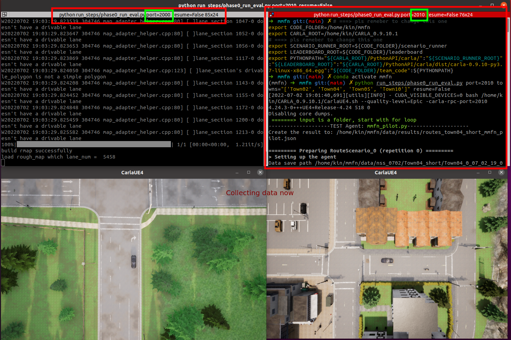
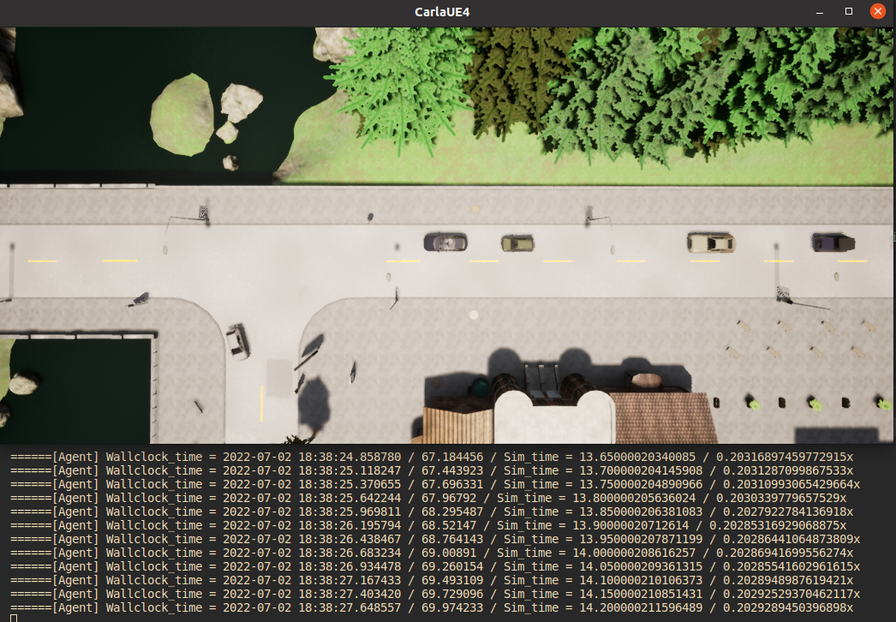

# MMFN: Multi-Modal Fusion Net for End-to-End Autonomous Driving

official branch for IROS 2022 paper codes including collecting data, all benchmark in paper, training scripts and evaluations etc.

[](https://paperswithcode.com/sota/carla-map-leaderboard-on-carla?p=mmfn-multi-modal-fusion-net-for-end-to-end) [](https://arxiv.org/abs/2207.00186)

## Quickly view

Background: How to efficiently use high-level information or sensor data in end-to-end driving. The whole architecture in MMFN from origin paper:

<center>

</center>
**Scripts** quick view in `run_steps` folder:

- `phase0_run_eval.py` : collect data/ run eval in select routes files or town map
- `phase1_preprocess.py` : pre-process data before training to speed up the whole training time
- `phase2_train.py`: after having training data, run this one to have model parameters files. pls remember to check the config (You can try training process on Docker also)

This repo also provide experts with multi-road consideration. Refer to more experts, pls check latest [carla-expert repo](https://github.com/Kin-Zhang/carla-expert)

## 0. Setup

Install anaconda
```Shell
wget https://repo.anaconda.com/archive/Anaconda3-2020.11-Linux-x86_64.sh
bash Anaconda3-2020.11-Linux-x86_64.sh
source ~/.profile
```

Clone the repo and build the environment

```Shell
git clone https://github.com/Kin-Zhang/mmfn
cd mmfn
conda create -n mmfn python=3.7
pip3 install -r requirements.txt
conda activate mmfn
```

For people who don't have CARLA [在内地的同学可以打开scripts换一下函数 走镜像下载更快点.. ]

```Shell
chmod +x scripts/*
./scripts/setup_carla.sh
# input version
10.1
# auto download now ...
```

Download the vectorized lib with `.so`, will install based on your system version, for commercial reason, we cannot open this part of codes(C++) fully but get the lib file, with lib setting, we can still directly input the opendrive file and output the vectorized lane, pls see more usage in the code
```Shell
./scripts/setup_lib.sh
```

bashrc or zshrc setting:
```bash
# << Leaderboard setting
# ===> pls remeber to change this one
export CODE_FOLDER=/home/kin/mmfn
export CARLA_ROOT=/home/kin/CARLA_0.9.10.1
# ===> pls remeber to change this one
export SCENARIO_RUNNER_ROOT=${CODE_FOLDER}/scenario_runner
export LEADERBOARD_ROOT=${CODE_FOLDER}/leaderboard
export PYTHONPATH="${CARLA_ROOT}/PythonAPI/carla/":"${SCENARIO_RUNNER_ROOT}":"${LEADERBOARD_ROOT}":"${CARLA_ROOT}/PythonAPI/carla/dist/carla-0.9.10-py3.7-linux-x86_64.egg":"${CODE_FOLDER}/team_code":${PYTHONPATH}
```

## 1. Dataset

The data is generated with ```leaderboard/expert_agent/mmfn_pilot.py``` in 8 CARLA towns using the routes and scenarios files provided at ```leaderboard/data``` on CARLA 0.9.10.1

The dataset is structured as follows:

```
- TownX_{tiny,short,long}: corresponding to different towns and routes files
    - TownX_X_07_01_23_26_34: contains data for an individual route
        - rgb_front: multi-view camera images at 400x300 resolution
        - lidar: 3d point cloud in .npy format
        - measurements: contains ego-agent's position, velocity and other metadata
        - radar: radar point in .npy format
        - maps: birdview maps image
        - opendrive: opendrive xodr file
```

### How to Generate

First, please modify the config files and on `.zshrc` or `.bashrc` remember to export your `CARLA_ROOT`

```bash
# please remember to change this!!! TODO or will change by modi
absolute_path: '/home/kin/mmfn'
carla_sh_path: '/home/kin/CARLA_0.9.10.1/CarlaUE4.sh'

# Seed used by the TrafficManager (default: 0)
port: 2000
trafficManagerSeed: 0

# ============== for all route test=============== #
debug: False

# only for debug ===> or just test the agent
routes: 'leaderboard/data/only_one_town.xml'
# towns: ['Town01', 'Town02', 'Town06', 'Town07']
# routes: 'leaderboard/data/training_routes/'

scenarios: 'leaderboard/data/all_towns_traffic_scenarios.json'

# ====================== Agent ========================= #
track: 'MAP' # 'SENSORS'
agent: 'team_code/expert_agent/auto_pilot.py'
defaults:
  - agent_config: expert
```

Please write great port according to the CARLA server, and inside the script it will try to use Epic or vulkan mode since opengl mode will have black point on raining day

```bash
python run_steps/phase0_run_eval.py
```

The dataset folder tree will like these one:

```bash
data
└── train
	├── Town06_tiny
        ├── Town06_00_07_01_23_40_19
            ├── lidar
            ├── maps
            ├── measurements
            ├── opendrive
            ├── rgb_front
            └── radar
        ├── Town06_00_07_01_23_40_19
        └── Town06_00_07_01_23_40_19
```

The scripts will start a CARLA with specific port number, example running like this:



Note: since official stable leaderboard have memory leak issue, [check out here](https://github.com/carla-simulator/leaderboard/issues/81). Please check your memory and kill it to resume. Other notes for CARLA leaderboard [check out here](https://github.com/Kin-Zhang/LAV/discussions/2)

## 2. Training

No need CARLA in these phase, please remember to modify the train.yml config file and especially ==modify the DATA PATH==

The record and visualization on training params use the wandb, please login before train, more details can be found at [wandb.ai](wandb.ai), You can disable wandb from config file using `disabled`

1. To speed up the training since the data process is somehow time consuming. Save the finished data:

    ```bash
    python run_steps/phase1_preprocess_data.py
    ```

2. DDP if you want to use multi-GPU through DDP or multi computers: `nproc_per_node`  as using GPU，`nnodes` as computer number

    ```bash
    CUDA_VISIBLE_DEVICES=0,1,2,3,4,5 python -m torch.distributed.launch --nproc_per_node=4 --nnodes=1 run_steps/phase2_train_net.py
    ```

3. Or one single GPU can just run:

   ```bash
   python run_steps/phase2_train_net.py
   ```

Note for Docker: There is a `Dockerfile` ready for building training environment, but please remember to using `-v` link the datasets folder to container.

### Benchmark

fork from transfuser codes, the benchmark training file and process can run as following command:

```bash
python team_code/benchmark/aim/train.py --device 'cuda:0'
python team_code/benchmark/cilrs/train.py --device 'cuda:0'
python team_code/benchmark/transfuser/train.py --device 'cuda:0'
```


## 3. Evaluate

This part is for evaluating to result or leaderboard, you can also download the modal file and try upload to leaderboard through leaderbaord branch. The whole process is the same way like generate dataset

1. Download or Train a model file saved to `log/mmfn_img` or `log/mmfn_vec` or `log/mmfn_rad`

3. Keep `config/eval.yaml` same as `collect.yaml` but modified model file location as first step side

    ```bash
    routes: 'leaderboard/data/only_one_town.xml'
    # ====================== Agent ========================= #
    track: 'MAP' # 'SENSORS'
    agent: 'team_code/e2e_agent/mmfn_imgnet.py'
    defaults:
      - agent_config: e2e
    
    # ======== e2e.yaml file for model path ============ #
    model_path: 'log/mmfn_img' 
    ```
    
4. Running eval python script and see result json file in `result` Folder

    ```bash
    python run_steps/phase0_run_eval.py
    ```

If all setting is correct, you will see eval like this one, pls remember to change route to `only_one_town` for debug.



## Cite Us

```latex
@inproceedings{mmfnzhang,
  title={MMFN: Multi-Modal Fusion Net for End-to-End Autonomous Driving},
  author={Qingwen Zhang, Mingkai Tang, Ruoyu Geng, Feiyi Chen, Ren Xin, Lujia Wang},
  booktitle={2022 IEEE International Conference on Intelligent Robotics and Systems (IROS)},
  year={2022},
  organization={IEEE}
}
```

## Acknowledgements

This implementation is based on code from several repositories. Please see our paper reference part to get more information on our reference

- [LBC](https://github.com/dotchen/LearningByCheating), [WorldOnRails](https://github.com/dotchen/WorldOnRails)
- [Transfuser](https://github.com/autonomousvision/transfuser)
- [CARLA Leaderboard](https://github.com/carla-simulator/leaderboard), [Scenario Runner](https://github.com/carla-simulator/scenario_runner)

- [carla-brid-view](https://github.com/deepsense-ai/carla-birdeye-view)
- [pylot](https://github.com/erdos-project/pylot)
